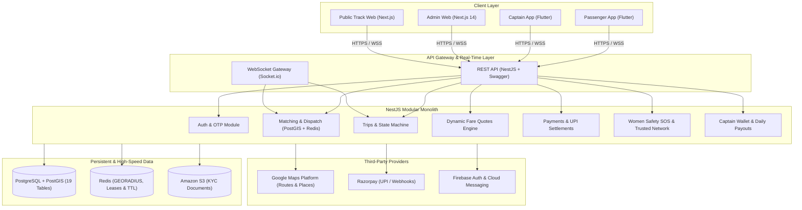

# SuperWomen System Architecture Blueprint

This document defines the complete end-to-end architecture for **SuperWomen**, an Uber-style ride-booking platform tailored for 100% women safety in India.

---

## 1. Monorepo Organization & Components

```
superwomen/
├── apps/
│   ├── passenger-app/       # Flutter + Dart (Rider Mobile App)
│   ├── driver-app/          # Flutter + Dart (Captain Mobile App)
│   ├── admin-web/           # Next.js 14 + TypeScript (Operations & Safety SOC)
│   └── api/                 # NestJS 10 + TypeScript (Core Business Engine)
├── packages/
│   └── api-contracts/       # Shared TypeScript schemas & DTOs
├── infrastructure/
│   ├── docker/              # Dockerfile & Docker Compose configs
│   ├── aws/                 # ECS Fargate, RDS, ElastiCache, S3 configs
│   └── monitoring/          # OpenTelemetry, Prometheus & Grafana configs
├── docs/
│   ├── architecture.md      # This document
│   ├── api-spec.yaml        # OpenAPI / Swagger 3.0 specification
│   └── database-schema.md   # PostgreSQL PostGIS + Redis data models
├── docker-compose.yml
└── package.json
```

---

## 2. High-Level Architecture Diagram



---

## 3. Core Business Workflows

### A. Dynamic Fare Estimation
1. Passenger inputs pickup and destination coordinates.
2. Server validates coordinates and calculates distance via Haversine / Google Routes API.
3. Pricing formula applied:
   $$\text{Fare} = \max(\text{BaseFare}, \text{BaseRate} + \text{Distance} \times \text{RatePerKm} + \text{Duration} \times \text{RatePerMin})$$
   - **SuperBike**: ₹30 base + ₹12/km (Min ₹50)
   - **SuperAuto**: ₹40 base + ₹15/km (Min ₹60)
4. Server generates cryptographic `fareQuoteId` with 10-minute expiry.

### B. High-Concurrency Driver Dispatch (Zero Race Condition)
1. Rider requests ride confirming quote.
2. Dispatch queries Redis `GEORADIUS captains:online` for nearby drivers.
3. Offer broadcasted to available captains.
4. When a captain taps Accept, the assignment is executed atomically:
   ```sql
   UPDATE rides 
   SET captain_id = $1, status = 'ACCEPTED' 
   WHERE id = $2 AND status = 'SEARCHING' AND captain_id IS NULL 
   RETURNING id, captain_id, status;
   ```
5. If zero rows updated, another driver already won the assignment; losing captain is gracefully notified.

### C. Ride Lifecycle State Machine
```
SEARCHING ──► ACCEPTED ──► CAPTAIN_ARRIVED ──► STARTED (OTP) ──► COMPLETED
    │             │               │                                   │
    ▼             ▼               ▼                                   ▼
CANCELLED     CANCELLED       CANCELLED                       80% Wallet Credit
```

### D. Real-Time Tracking Data Pipeline
- Driver GPS updates sent via `PUT /v1/driver/location` or `POST /v1/captains/location`.
- Position updated in Redis GEO cache with 300s TTL.
- Broadcasted to WebSocket room `ride:<rideId>` under events:
  - `driver.location.updated`
  - `driver_location`
- Passenger map marker smoothly interpolates to new coordinates.

### E. Women Safety & Emergency Network
- Passenger or driver triggers SOS with live coordinates.
- WebSocket alert pushed immediately to Admin SOC (`admins` room).
- Automatic SMS alerts dispatched to all registered `EmergencyContact` records with live tracking link.
- Immutable audit trail created in `SosEvent` and `AuditLog`.
